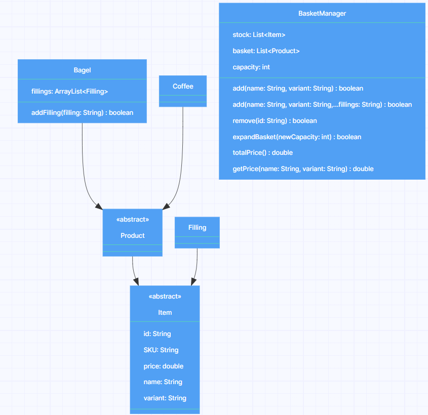

## Domain Model

| Classes                  | Properties                | Methods                                                         | Scenarios                                                                | Outputs/Outcomes                                      |
|--------------------------|---------------------------|-----------------------------------------------------------------|--------------------------------------------------------------------------|-------------------------------------------------------|
| `Item`                   |                           |                                                                 |                                                                          |                                                       |
|                          | `id: String`              |                                                                 |                                                                          |                                                       |
|                          | `SKU: String`             |                                                                 |                                                                          |                                                       |
|                          | `price: double`           |                                                                 |                                                                          |                                                       |
|                          | `name: String`            |                                                                 |                                                                          |                                                       |
|                          | `variant: String`         |                                                                 |                                                                          |                                                       |
| `Product extends Item`   |                           |                                                                 |                                                                          |                                                       |
| `Filling extends Item`   |                           |                                                                 |                                                                          |                                                       |
| `Bagel extends Product`  |                           |                                                                 |                                                                          |                                                       |
|                          | `fillings: List<Filling>` |                                                                 |                                                                          |                                                       |
|                          |                           | `addFilling(String filling): boolean`                           | User Story 8, 10: Given filling exists                                   | Return true, add filling to bagel                     |
|                          |                           |                                                                 | User Story 10:    Given filling does not exist                           | Return false, inform the user                         |
| `Coffee extends Product` |                           |                                                                 |                                                                          |                                                       |
| `BasketManager`          |                           |                                                                 |                                                                          |                                                       |
|                          | `stock: List<Item>`       |                                                                 |                                                                          |                                                       |
|                          | `basket: List<Product>`   |                                                                 |                                                                          |                                                       |
|                          | `capacity: int`           |                                                                 |                                                                          |                                                       |
|                          |                           | `add(String name, String variant): boolean`                     | User Story 1, 10: Given name and variant exist                           | Return true, add product to basket list               |
|                          |                           |                                                                 | User Story 10:    Given name or variant does not exist                   | Return false, inform the user                         |
|                          |                           |                                                                 | User Story 3:     Basket is not full                                     | Move to User Story 1                                  |
|                          |                           |                                                                 | User Story 3:     Basket is full                                         | Return false, inform the user                         |
|                          |                           | `add(String name, String variant, String ...fillings): boolean` | User Story 8, 10: Given name and variant and filling exists              | Return true, add product with fillings to basket list |
|                          |                           |                                                                 | User Story 10:    Given name or variant or filling does not exist        | Return false, inform the user                         |
|                          |                           |                                                                 | User Story 3:     Basket is not full                                     | Move to User Story 1                                  |
|                          |                           |                                                                 | User Story 3:     Basket is full                                         | Return false, inform the user                         |
|                          |                           | `remove(String id): boolean`                                    | User Story 2:     Given id exists in the basket                          | Return true, remove the product from the basket       |
|                          |                           |                                                                 | User Story 5:     Given id does not exist in the basket                  | Return false, inform the user                         |
|                          |                           | `expandBasket(int newCapacity): boolean`                        | User Story 4:     newCapacity is greater than capacity                   | Return true, set the capacity to newCapacity          |
|                          |                           |                                                                 | User Story 4:     newCapacity is less than or equal to previous capacity | Return false, inform the manager                      |
|                          |                           | `totalPrice(): double`                                          | User Story 6:     Basket is not empty                                    | Return total price of products in basket              |
|                          |                           |                                                                 | User Story 6:     Basket is empty                                        | Return 0, inform the user                             |
|                          |                           | `getPrice(String name, String variant): double`                 | User Story 7, 9:  Given name and variant exist                           | Return product price                                  |
|                          |                           |                                                                 | User Story 7, 9:  Given name or variant does not exist                   | Return -1, inform the user                            |

## UML Model

