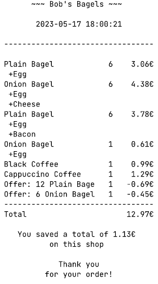

| Classes                   | Properties                      | Methods                                           | Scenarios                                                                | Outputs/Outcomes                                         |
|---------------------------|---------------------------------|---------------------------------------------------|--------------------------------------------------------------------------|----------------------------------------------------------|
| `Item`                    |                                 |                                                   |                                                                          |                                                          |
|                           | `id: String`                    |                                                   |                                                                          |                                                          |
|                           | `SKU: String`                   |                                                   |                                                                          |                                                          |
|                           | `price: double`                 |                                                   |                                                                          |                                                          |
|                           | `name: String`                  |                                                   |                                                                          |                                                          |
|                           | `variant: String`               |                                                   |                                                                          |                                                          |
| `Product extends Item`    |                                 |                                                   |                                                                          |                                                          |
|                           | `supplements: List<Supplement>` |                                                   |                                                                          |                                                          |
| `Supplement extends Item` |                                 |                                                   |                                                                          |                                                          |
|                           |                                 | `addSupplement(Supplement supplement): void`      | User Story 8, 10: Given supplement exists                                | Return true, add supplement to bagel                     |
| `Basket`                  |                                 |                                                   |                                                                          |                                                          |
|                           | `inventory: List<Item>`         |                                                   |                                                                          |                                                          |
|                           | `products: List<Product>`       |                                                   |                                                                          |                                                          |
|                           | `capacity: int`                 |                                                   |                                                                          |                                                          |
|                           |                                 | `add(String SKU, String ...supplements): boolean` | User Story 1, 10: Given SKU exist                                        | Return true, add product to basket list                  |
|                           |                                 |                                                   | User Story 8, 10: Given SKU and supplement exists                        | Return true, add product with supplements to basket list |
|                           |                                 |                                                   | User Story 10:    Given SKU or supplement does not exist                 | Return false, inform the user                            |
|                           |                                 |                                                   | User Story 3:     Basket is not full                                     | Move to User Story 1                                     |
|                           |                                 |                                                   | User Story 3:     Basket is full                                         | Return false, inform the user                            |
|                           |                                 |                                                   | User Story 10:    Given supplement does not exist                        | Return false, inform the user                            |
|                           |                                 | `remove(String id): boolean`                      | User Story 2:     Given id exists in the basket                          | Return true, remove the product from the basket          |
|                           |                                 |                                                   | User Story 5:     Given id does not exist in the basket                  | Return false, inform the user                            |
|                           |                                 | `expandBasket(int newCapacity): boolean`          | User Story 4:     newCapacity is greater than capacity                   | Return true, set the capacity to newCapacity             |
|                           |                                 |                                                   | User Story 4:     newCapacity is less than or equal to previous capacity | Return false, inform the manager                         |
|                           |                                 | `totalPrice(): double`                            | User Story 6:     Basket is not empty                                    | Return total price of products in basket                 |
|                           |                                 |                                                   | User Story 6:     Basket is empty                                        | Return 0, inform the user                                |
|                           |                                 | `getPrice(String SKU): double`                    | User Story 7, 9:  Given SKU exist                                        | Return product price                                     |
|                           |                                 |                                                   | User Story 7, 9:  Given SKU does not exist                               | Return -1, inform the user                               |

## Extension Model

| Classes    | Properties                        | Methods    | Scenarios      | Outputs/Outcomes                                                                    |
|------------|-----------------------------------|------------|----------------|-------------------------------------------------------------------------------------|
| `Receipt`  |                                   |            |                |                                                                                     |
|            | `total: double`                   |            |                |                                                                                     |
|            | `totalDiscount: double`           |            |                |                                                                                     |
|            | `receiptItems: List<ReceiptItem>` |            |                |                                                                                     |
|            |                                   | `print()`  | User Story 11: | Prints the receipt. Below is an example output containing discounts and supplements |

